  

  

  

  

  

  

  
  

  

How these numbers are produced

 

Every figure above is generated by `scripts/generate.mjs` from the GitHub GraphQL and REST APIs and refreshed daily by a scheduled workflow. None of it is typed in by hand, and nothing is shown that the API cannot actually account for.

- **Total commits** sums `contributionsCollection` year by year from the account creation date onward, including private contributions.
- **Lines written and removed** come from each repository's contributor statistics, filtered to this account. That covers repositories owned by this account which the token can read, so the figure is a floor rather than a universal count of every line ever written.
- **Language volume** is measured in bytes. Bytes are the only unit the GitHub API exposes for languages, so this is deliberately not presented as a line count.
- **Streaks** and **most active day** are computed from the daily contribution calendar across every year of the account.
- **Contributions in the last 12 months** counts the trailing 365 days, not the calendar year.

Panels are hand-written SVG. The typography is a 5x7 bitmap font drawn as vector geometry, and the scene in the header is a sprite sheet stepped by CSS, so the whole header is one uninterrupted image.

